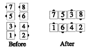
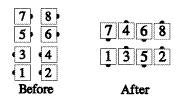

# Cast a Shadow

From the following formations only:
- 2x4 with the ends forming a tandem
- Promenade or Wrong Way Promenade

From a 2x4 formation with the ends forming a tandem: ends ½
[Zoom](../b2/zoom.md), [Arm Turn](../ms/turn_thru.md) ¾,
and [Spread](../plus/anything_and_spread.md),
to become ends of a 2x4. Meanwhile centers
facing out [Cloverleaf](../ms/cloverleaf.md) and centers facing in
[Extend](../plus/extend.md), Arm Turn 1/4,
and Extend. The centers finish as centers of a 2x4 by stepping in between ends who spread
apart.  In the case in which all the centers are facing in, 
they [Pass In](pass_in.md) and [Pass Thru](../b1/pass_thru.md); 
if all centers are facing out, they Cloverleaf.

> 
> 
> 

From Promenade or Wrong Way Promenade: The caller must designate two couples, 
e.g., Heads Cast a Shadow.
Everyone acts as though the formation were two-faced lines, with the designated couples as
the leads. Thus, the outsides do a ½ Zoom
(with the designated outside acting as the lead), Arm Turn ¾, and Spread, while the
designated centers [Cloverleaf](../ms/cloverleaf.md),
and the other centers Hinge and Extend. Ends in parallel waves.

Note: Cast a Shadow is not proper from Columns because 
the ends are not in tandem with each other.

Timing: 10
###### @ Copyright 1982, 1986-1988, 1995, 2001-2020. Bill Davis, John Sybalsky, and CALLERLAB Inc., The International Association of Square Dance Callers. Permission to reprint, republish, and create derivative works without royalty is hereby granted, provided this notice appears. Publication on the Internet of derivative works without royalty is hereby granted provided this notice appears. Permission to quote parts or all of this document without royalty is hereby granted, provided this notice is included. Information contained herein shall not be changed nor revised in any derivation or publication.
