# All 4 Couples / All 8 concepts

From the general versions of static square, circle, and Thar: These concepts are applied to 4-dancer
calls (or calls using fewer dancers), and allow all eight dancers to do the call at once. Each group of 4
dancers works with themselves as though the other group were not there.

When the dancers would normally walk through the middle of the square (e.g. as part of a Pass Thru
or Pull By), they walk around the perimeter instead. All the hand actions and shoulder passes are
the same as for the basic call. However, passing the other dancers (e.g., heads passing sides)
alternates between right shoulders and left shoulders. An example of this shoulder passing can be
found in All 4 Couples Right and Left Thru.

When two dancers would normally walk through the center of the square (e.g. as part of a centers
Pull By or centers arm turn), they still go through the center--they adjust into a star as they go, to
avoid collisions. Examples of this can be found in All 8 Swing Thru and All 8 Dixie Style To A Wave.

Some calls contain both traffic patterns. From a squared set, All 4 Couples Square Chain Thru would
be danced as a pass your corner right shoulder, Right Pull By, pass the next left shoulder, step to
left-hand wave with the next, all arm turn 1/2 by the left, center 4 star 1/2 by the right, all left turn
thru and pass the next left shoulders. Ends in a squared set with everyone facing out. The dancers
who started on the head spots are now on the side spots.

At the end of the call, you must adjust to the nearest static square footprints of the wall you are
facing. For example, if you end facing the head walls, adjust (without turning) to the nearest head
position. If you end on Thar spots, you don't adjust.

The initial traffic pattern determines the name of the concept. If the initial traffic pattern requires
all dancers to walk around the perimeter, "All Four Couples" is used.
Otherwise, "All Eight" is used.

**All 4 Couples Chase Right** Timing: 10

From a static square with everyone facing out, those at the head position Chase Right
while those at the side position also Chase Right. All action is clockwise around the
outside of the set. Ends on static square spots with dancers in right-hand mini-waves.

> 
> 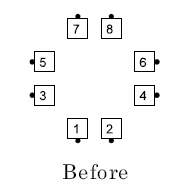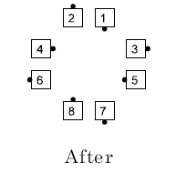
> 

**All 4 Couples Right and Left Thru** Timing: 10

From a static square or circle: All pass corners right shoulders, Right Pull By with
opposite, pass the next dancer left shoulders, and Courtesy Turn with partner, to end
facing the center of the set.

> 
> 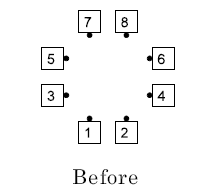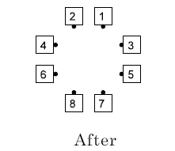
> 

**All 4 Couples Star Thru, etc.** Timing: 6

From a square or circle: All pass corner right shoulders, Star Thru, etc. For example,
All Four Couples Touch 1/4:

> 
> 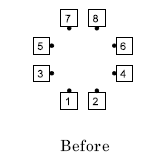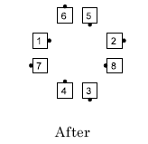
> 

**All 8 Dixie Style To A Wave** Timing: 8

From a static square, the right hand dancers step forward and to the left to become the
lead dancer in a tandem. Lead dancers join right hands in a star and Pull By. All Left
Touch 1/4. Ends in a Thar Star.

> 
> 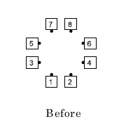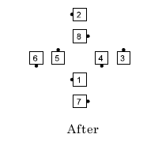
> 

**All 8 Mix** Timing: 10

From a Thar or Wrong Way Thar, the centers cross run, by turning their star 1/2 and
sliding nose-to-nose with the outsides (Slide). The new centers trade, by turning their
star 1/2. Ends in a Thar or Wrong Way Thar.

**All 8 Swing Thru** Timing: 8

From a Wrong Way Thar, all arm turn 1/2 by the right. Center 4 star 1/2 by the left. Ends
in a Wrong Way Thar.

> 
> 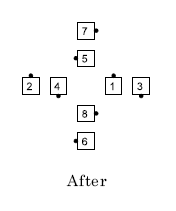
> 

**All 8 Walk and Dodge** Timing: 6

From a static square with everyone in a mini-wave, those facing in walk forward across
the set to take the place of the dancer who was directly in front of him. Those facing out
step sideways into the position vacated by the "walker". Ends in a static square
with everyone facing out. If all the "walkers" move at the same rate, there will
be a momentary star 1/2 way through the call.

> 
> 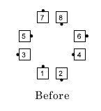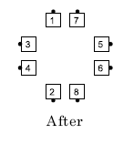
> 

Teaching hints to tell the dancers:

1. Based on the call, identify the 4 dancers whom you will work with. 
2. Do the call as if the other 4 dancers weren't there. Avoid colliding with them either by using a star when you go through the middle or passing them on the perimeter. 
3. At the end of the call you must adjust (without turning) to the nearest static square footprints of the wall you are facing. 
4. If you end on Thar spots, you don't adjust. 

###### @ Copyright 1982, 1986-1988, 1995, 2001-2020. Bill Davis, John Sybalsky, and CALLERLAB Inc., The International Association of Square Dance Callers. Permission to reprint, republish, and create derivative works without royalty is hereby granted, provided this notice appears. Publication on the Internet of derivative works without royalty is hereby granted provided this notice appears. Permission to quote parts or all of this document without royalty is hereby granted, provided this notice is included. Information contained herein shall not be changed nor revised in any derivation or publication.
