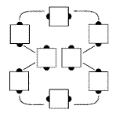
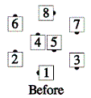
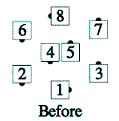

# Hourglass Formation

## Hourglass Circulate

Timing: 4

From an Hourglass: Each dancer does a [Circulate](../b1/circulate.md) 
by moving forward one position in the
hourglass, to take that dancer's place. Dancers move along the path shown:

> 
> 
>

Points become centers, and centers become points. Also, the diamond dancers move to the
box, and the box dancers move to the diamond.

For Teaching: Tell each dancer to move up to the next person's spot in the hourglass,
taking his footsteps. During this call, everyone keeps the same shoulder toward the center
of the set. This is a good call for using a demonstration square.

## Cut/Flip the Hourglass

### Cut the Hourglass

Timing: 6

From an Hourglass: The points slide together and [Trade](../b2/trade.md), while the others
[Hourglass Circulate](hourglass_circulate.md). Ends in Parallel Lines or Waves.

### Flip the Hourglass

Timing: 4

From an Hourglass: The points [ Run](../b2/run.md) to the nearest center (Flip in as
for [Flip the Diamond](../plus/flip_the_diamond.md)), while the others
[Hourglass Circulate](hourglass_circulate.md).

>
>   
> 
>

###### @ Copyright 1982, 1986-1988, 1995, 2001-2023. Bill Davis, John Sybalsky, and CALLERLAB Inc., The International Association of Square Dance Callers. Permission to reprint, republish, and create derivative works without royalty is hereby granted, provided this notice appears. Publication on the Internet of derivative works without royalty is hereby granted provided this notice appears. Permission to quote parts or all of this document without royalty is hereby granted, provided this notice is included. Information contained herein shall not be changed nor revised in any derivation or publication.
