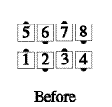
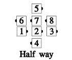
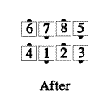
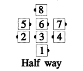
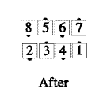
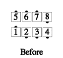
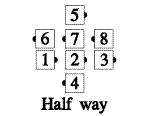
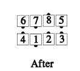

# In/Out Roll Circulate

## In-Roll Circulate

Timing: 4

From general lines, with the ends forming a tandem: In each line, the end facing in
[Circulates](../b1/circulate.md). Meanwhile, each of the other dancers (in a single, smooth motion) faces the
vacated spot, steps forward, and turns another 1/4 the same way he first turned. Ends back
in parallel lines or waves.

The non-circulators' part is a single motion, rather than a 3-part move. This call can
be fractionalized into halves, as shown below.

> 
>   
>   
> 
> 

For Teaching: You can describe the non-circulators' part as a [ Run](../b2/run.md) (or Flip) toward the
vacated spot. This captures the idea of a single, flowing motion for them.

## Out-Roll Circulate

Timing: 6

From general lines, with the ends forming a tandem: In each line, the end facing out
[Circulates](../b1/circulate.md). Meanwhile, each of the other dancers, in a single, smooth motion, faces the
vacated spot, takes a step forward, and turns another 1/4 in the same direction he first
turned. Ends back in parallel waves or lines.

The non-circulators' part is a single motion, rather than a 3-part move. This call can
be fractionalized into halves, as shown below.

>
>   
>   
> 
>

For Teaching: You can describe the non-circulators' part as a [Run](../b2/run.md) toward the vacated
spot. This captures the idea of a single, flowing motion for them.

###### @ Copyright 1982, 1986-1988, 1995, 2001-2020. Bill Davis, John Sybalsky, and CALLERLAB Inc., The International Association of Square Dance Callers. Permission to reprint, republish, and create derivative works without royalty is hereby granted, provided this notice appears. Publication on the Internet of derivative works without royalty is hereby granted provided this notice appears. Permission to quote parts or all of this document without royalty is hereby granted, provided this notice is included. Information contained herein shall not be changed nor revised in any derivation or publication.
