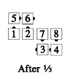

# Mini-Busy

From parallel two-faced lines:
The trailers [As Couples](../a1/as_couples.md)
{high:MiniBusy1}[Extend](../b2/extend.md){/high},
have {high:MiniBusy2}the center two
[Hinge](../ms/hinge.md){/high},
and {high:MiniBusy3}[Flip the Diamond](../plus/flip_the_diamond.md){/high}.
Meanwhile, the lead couples (working around the outside)
{high:MiniBusy1}Face In{/high},
{high:MiniBusy2}step forward one spot{/high},
and {high:MiniBusy3}Face In{/high}. Ends in a quarter-tag formation.
This call has three parts, as illustrated below:

> 
> 
> 

Timing: 6

###### @ Copyright 1982, 1986-1988, 1995, 2001-2020. Bill Davis, John Sybalsky, and CALLERLAB Inc., The International Association of Square Dance Callers. Permission to reprint, republish, and create derivative works without royalty is hereby granted, provided this notice appears. Publication on the Internet of derivative works without royalty is hereby granted provided this notice appears. Permission to quote parts or all of this document without royalty is hereby granted, provided this notice is included. Information contained herein shall not be changed nor revised in any derivation or publication.
