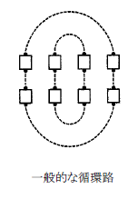
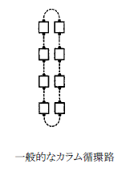
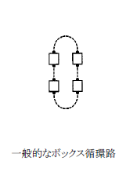
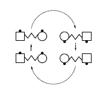
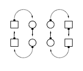

# Circulate Family

一般的に、すべてのCirculate(サーキュレイト)はそれぞれのダンサーをして定められた軌道（“循環路”と呼ぶ）を次のダンサー位置まで前進させるものである。 下に定義を述べるが次の図を参照されたい。

> 
> 
> 
> 
> 

Circulate Family (サーキュレイト ファミリー)ではオーシャンウエイブの規則や向かい合ったカプルの規則（第１部総記、約束事と規則を参照）は適用されない。

Circulate Family (サーキュレイト ファミリー)では動作を分割して使うことは適切であり、時々使われる。 第４部付加細目分数を参照。

Circulate(サーキュレイト)のタイミングはすべて４拍であるが、Pass Thru（パス スルー）効果を持つCirculate (サーキュレイト)は２拍となる。

Circulate(サーキュレイト)にはいろいろなタイプのものがあり、いろいろな名前が付けられているが、次に詳しく述べる。

## (Named Dancers) Circulate(名指しをされたダンサーのサーキュレイト)

### 動作を始める隊形

一般的なライン（例えば、オーシャン ウエイブ、トゥー フェイスト ライン）、一般的なカラム。

### コール例

#### Centers (or Ends) Circulate
#### Girls (or Boys) Circulate
#### Everyone Circulate
#### Circulate

### 動作

指示された人(アクティブ)は一般的なラインまたは一般的なカラム循環路に沿って次のダンサー位置に前進する。

### 動作を終わる隊形

一般的なライン、一般的なカラム。

### スタイリング

腕は自然な手の位置を保持し、適切な位置にとって次のコールに備える。

### 注釈

(Named Dancers) Circulate(名指しをされたダンサーのサーキュレイト)は通常一般的なラインからコールされる。

すべてのダンサーがアクティブである場合（例えば、Everyone Circulate）、All 8 Circulate（オール エイト サーキュレイト）（＃21.ｃ）の注釈も適用される。

一部のダンサーのみがアクティブであることが、直前の動作（例えば、Dive Thru, Centers Touch 1/4 and Circulate）から明らかである場合を除き、Circulate（サーキュレイト）はEveryone Circulate（エブリワン サーキュレイト）に同じである。

必ずしもすべてのダンサーが与えられた循環路を同じ方向へ行く必要はない。 同じ循環路を反対方向へ行くダンサーは右肩で通り過ぎる。 （第１部総記、約束事と規則、通り過ぎる時の規則を参照）

(Named Dancers) Circulate(名指しをされたダンサーのサーキュレイト)は時々通常でない隊形から使われる場合がある。 各ダンサーはスムーズに次のダンサー位置へ歩を進める。 例えば、

- オーシャンウエイブから: Split Circulate 1 1/2, Center Wave Swing Thru, Others Circulate
- トゥー フェイスト ラインから: Centers Hinge, Outside 6 Circulate, Centers Hinge
- カラムから: Circulate 1 1/2, Center 6 Circulate 1 1/2, Center 4 Walk And Dodge, Others Bend The Line
- 向かい合たラインから: Outsides Touch 1/4, Centers Pass the Ocean, Outside 6 Circulate
- タイダルウエイブから: Center 4 Hinge, Same Ones Circulate (or use Box Circulate (下記))

(Named Dancers) Circulate(名指しをされたダンサーのサーキュレイト)で、Circulate（サーキュレイト）をするダンサーがインアクティブダンサーと同じ位置で終わるようになるのは適切ではない。 例えばカラムからEnds Circulateである。 カラムからは、コーラーがダンサーは中心で動作することを明確にして、”Centers Circulate”をコールするのみが適切である。 例えば、“Boys work in the center and Circulate”である。 代わりにBox Circulate（ボックス サーキュレイト）(#21.e)を使うこともできる。 例えば、“Centers Box Circulate”である。

## Couples Circulate（カプルズ サーキュレイト）

### 動作を始める隊形

 トゥー フェイスト ライン。

### コール例

#### Couples Circulate

### 動作

各カプルは一組となり一般的なボックス循環路（上図参照）に沿って次の位置に前進する。

例：

>
> 
>

### 動作を終わる隊形

 トゥー フェイスト ライン。

### スタイリング

Couples Circulate（カプルズ サーキュレイト）ではすべてのダンサーがカプルの手の取り方を保持する。短いほうの距離を動くカプルは歩幅をより狭く取り、より長い距離を移動するカプルに合わせる。 より長い距離を移動するカプルは急いではいけない。 腕は自然な手の位置を保持し、適切な位置にとって次のコールに備える。

## All 8 Circulate（オール エイト サーキュレイト）

### 動作を始める隊形

一般的なライン（例えば、オーシャン ウエイブ、トゥー フェイスト ライン）、一般的なカラム。

### コール例

#### All 8 Circulate

### 動作

すべてのダンサーがCirculate (サーキュレイト)する。

### 動作を終わる隊形

一般的なライン、一般的なカラム。 オーシャン ウエイブ、トゥー フェイスト ライン、カラムからの動作を始める隊形に同じ。

### スタイリング

(Named Dancers) Circulate(名指しを受けたダンサーのサーキュレイト)（#21.a）に同じ。

### 注釈

All 8 Circulate（オール エイト サーキュレイト）を常に“外は外、中は中に”と教えるのは不適切である。 これはオーシャン ウエイブと、トゥー フェイスト ラインからは正しいが、カラムからは正しくない。

トゥー フェイスト ラインからはAll 8 Circulate（オール エイト サーキュレイト）をコールするよりはCouples Circulate（カプルズ サーキュレイト）（＃21.b）のほうがより一般的である。カラムからのSingle File Circulate（シングル ファイル サーキュレイト）（＃２１.ｄ）もAll 8 Circulate（オール エイト サーキュレイト）と同じ。

同じ循環路で反対方向へ行くダンサーがいる場合は、All 8 Circulate（オール エイト サーキュレイト）はしばしば他の動作（例えば、Pass Thru（パス スルー）やTrade By（トレイド バイ））と同じに
なる。 このような使い方は適切ではあるが、混乱するダンサーは多い。 コーラーの意図的な指
示により作った隊形を除き、ダンサーをひっかけようと思われるような使い方は避けるべきである。
一方、スリー バイ ワン ラインからのAll 8 Circulate（オール エイト サーキュレイト）は容認できる
が、メインストリームではまだ難しく、一般的ではない。

## Single File Circulate（シングル ファイル サーキュレイト）

### 動作を始める隊形

カラムのみ。

### コール例

#### Circulate
#### Column Circulate
#### Single File Circulate

### 動作

すべてのダンサーがCirculate (サーキュレイト)する。

### 動作を終わる隊形

カラム。

### スタイリング

(Named Dancers) Circulate(名指しをされたダンサーのサーキュレイト)（#21.a）に同じ。

## Box/Split Circulate（ボックス／スプリット サーキュレイト）

Box/Split Circulate（ボックス／スプリット サーキュレイト）は似ているが、二つの事例に分けて取り扱う。

## 事例１： Box Circulate（ボックス サーキュレイト）

### 動作を始める隊形

Box Circulate（ボックス サーキュレイト）

### コール例

#### Heads Touch 1/4; Heads Box Circulate
#### Centers Box Circulate
#### Pass To The Center; Centers Touch 1/4 and Box Circulate

### 動作

各ダンサーは一般的なボックス循環路（上図参照）に従い、次の位置へ前進する。

### 動作を終わる隊形

Box Circulate（ボックス サーキュレイト）

### スタイリング

(Named Dancers) Circulate(名指しを受けたダンサーのサーキュレイト)（#21.a）に同じ。

### 注釈

Box Circulate（ボックス サーキュレイト）は一組の４人のダンサーを特定して行うのが適切で、二組の４人のダンサーを指定するのは稀である。 例えば、“On each side Box Circulate”ということはできるが、“Split Circulate”のほうがより一般的で、好ましい。

ダンサーがBox Circulate（ボックス サーキュレイト）隊形にいると見極めることができる場合は、Box Circulate（ボックス サーキュレイト）とCirculate（サーキュレイト）は同じで、Circulate（サーキュレイト）のみをコールするコーラーは多い。

## 事例２： Split Circulate（スプリット サーキュレイト）

### 動作を始める隊形

一般的なライン（例えば、オーシャン ウエイブ）、一般的なカラム。

### コール例

#### Split Circulate

### 動作

隊形を半分に分ける（”Split”）。 それぞれの半分にいるダンサーが一般的なボックス循環路（上図参照）に従い、次の位置へ前進する。

 例：

> 
> 
> 

### 動作を終わる隊形

一般的なライン、一般的なカラム。 オーシャン ウエイブとカラムから動作を始める隊形に同じ。

### スタイリング

(Named Dancers) Circulate(名指しを受けたダンサーのサーキュレイト)（#21.a）に同じ。

###### @ 版権 1994, 2000-2017 CALLERLAB、スクエアダンスコーラー国際協会。 再印刷、再発行、使用料の 発生しない写物製作はこの文章表示を条件にこれを許可する。 使用料の発生しないインターネットでの刊行 はこの文章表示を条件にこれを許可する。 使用料の発生しない一部または全ての引用はこの文章表示を条件 にこれを許可する。 いかなる写物製作または刊行においても本書内の資料は変更されまた改訂されてはなら ない。

