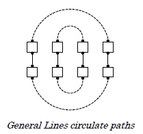
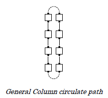
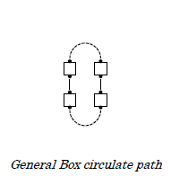

# Circulate Family

In general, all Circulates have each dancer move forward along a defined path
(called the "circulate path") to the next dancer position.
The definitions below will refer to the following diagrams.

> 
> 
> 

No call in the Circulate Family can be used with the [Ocean Wave Rule](../b2/ocean_wave_rule.md) or the
Facing Couples Rule (see "Part 1: General: Conventions and Rule").

Fractions are proper and occasionally used with calls in the Circulate family.
See "Additional Detail: Fractions".

The timing for all Circulates is 4, but if the Circulate has the effect of a Pass Thru, the timing is 2.

The various types of Circulates and various ways to name them are described in detail
in the following sections.

## (Named Dancers) Circulate

### Starting formations

General Lines (e.g., Ocean Waves, Two-Faced Lines), General Columns

### Command examples

#### Centers (or Ends) Circulate
#### Girls (or Boys) Circulate
#### Everyone Circulate
#### Circulate

### Dance action

Designated dancers move forward to the next dancer position, following their General Lines or
General Column circulate path.

A dancer looking out of the formation walks in a 180-degree arc and finishes
in the next position on the other side, looking in. Others walk forward one dancer position.

### Ending formations

General Lines, General Columns

### Styling

Arms should be held in natural dance position and ready to assume appropriate position for the next call

### Comments

The call "(Named Dancers) Circulate" is usually used from General Lines.

When all dancers are active (e.g., Everyone Circulate), the comments in All 8 Circulate also apply.

Circulate is the same as Everyone Circulate, unless it is clear from the previous call that only certain dancers are active (e.g., Dive Thru, Centers Touch 1/4 and Circulate).

Not all dancers on a given circulate path need to go in the same direction. Dancers going in opposite directions along the same path will pass right shoulders. (See "Part 1: General: Conventions and Rules: Passing Rule".)

(Named Dancers) Circulate is sometimes used more generally with unusual formations. Each dancer walks forward in a smooth path to the next dancer position. For example:
 
- Ocean Waves: Split Circulate 1 1/2, Center Wave Swing Thru, Others Circulate
- Two-Faced Lines: Centers Hinge, Outside 6 Circulate, Centers Hinge
- Columns: Circulate 1 1/2, Center 6 Circulate 1 1/2, Center 4 Walk And Dodge, Others Bend The Line
- Facing Lines: Outsides Touch 1/4, Centers Pass the Ocean, Outside 6 Circulate
- Tidal Wave: Center 4 Hinge, Same Ones Circulate (or use Box Circulate)

It is improper for (Named Dancers) Circulate to cause a circulating dancer
to end on the same spot as an inactive dancer,
e.g., from Columns, Ends Circulate. From Columns, "Centers Circulate" is only
proper if the caller makes it clear that the dancers must stay in the center,
e.g., "Boys work in the center and Circulate". Box Circulate could
instead be used, e.g., “Centers Box Circulate”.

## Couples Circulate

### Starting formation

Two-Faced Lines

### Command example

Couples Circulate

### Dance action

Each couple works as a unit to move forward to the next position,
following the General Box circulate path (see above). Example:

>
> 
>

### Ending formation

Two-Faced Lines

### Styling

All dancers maintain a couple handhold for Couples Circulate.
Couples traveling the shorter distance should adjust with shorter steps
to coincide with those traveling the longer distance. Those traveling the
longer distance should not rush. Arms should be held in natural dance position
and ready to assume appropriate position for the next call.

## All 8 Circulate

### Starting formations

General Lines (e.g., Ocean Waves, Two-Faced Lines), General Columns

### Command example

All 8 Circulate

### Dance action

All dancers Circulate.

### Ending formations

General Lines, General Columns. Same as starting formation from Ocean Waves, 
Two-Faced Lines, and Columns.

### Styling

Same as for (Named Dancers) Circulate

### Comments

It is improper to teach that All 8 Circulate always means
"ends stay ends and centers stay centers".
This statement is true from Ocean Waves and Two-Faced Lines, but not from Columns.

From Two-Faced Lines, Couples Circulate is a more common way to call All 8 Circulate.
From Columns, Single File Circulate is the same as All 8 Circulate.

When dancers go in opposite directions along the same path,
All 8 Circulate is often equivalent to other calls (e.g., Pass Thru or Trade By).
These applications are proper, but confusing to many dancers.
Except in an instructional setting, they are often perceived as attempts
to trick the dancers and should probably be avoided. On the other hand,
All 8 Circulate from Three And One Lines is acceptable, though still difficult
and uncommon at Mainstream.

## Single File Circulate

### Starting formation

Columns Only

### Command examples

#### Circulate
#### Column Circulate
#### Single File Circulate

### Dance action

All dancers Circulate

### Ending formation

Columns

### Styling

Same as for (Named Dancers) Circulate

## Box / Split Circulate

Box Circulate and Split Circulate, while similar, are covered in two separate cases.

## Box Circulate

### Starting formation

Box Circulate

### Command examples

#### Heads Touch 1/4; Heads Box Circulate
#### Centers Box Circulate
#### Pass To The Center; Centers Touch 1/4 and Box Circulate

### Dance action

Each dancer moves forward to the next position, following the General Box circulate path (see above).

### Ending formation

Box Circulate

### Styling

Same as for (Named Dancers) Circulate

### Comments

Box Circulate is proper only after specifying a group of four dancers or,
rarely, groups of four dancers. For example, one could say
"On each side Box Circulate" but "Split Circulate"
would be more common and preferred.

Once dancers in a Box Circulate formation are identified, Box Circulate
and Circulate are the same, and many callers will say only "Circulate".

## Split Circulate

### Starting formations

General Lines (e.g., Ocean Waves), General Columns

### Command example

#### Split Circulate

### Dance action

Divide ("split") the formation in half.
Dancers in each half move forward to the next position,
following the General Box circulate path (see above). Examples:

> 
> 
> 

### Ending formations

General Lines, General Columns. Same as starting formation from Ocean Waves and
Columns.

### Styling

Same as for (Named Dancers) Circulate

###### @ Copyright 1994, 2000-2021 by CALLERLAB Inc., The International Association of Square Dance Callers. Permission to reprint, republish, and create derivative works without royalty is hereby granted, provided this notice appears. Publication on the Internet of derivative works without royalty is hereby granted provided this notice appears. Permission to quote parts or all of this document without royalty is hereby granted, provided this notice is included. Information contained herein shall not be changed nor revised in any derivation or publication.
