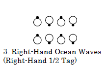
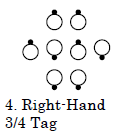
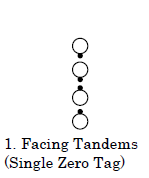
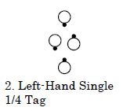

# Extend

Beim Extend bewegen sich Tänzer von einer Tagging-Formation zur nächsten. Es gibt fünf Tagging-Formationen
mit acht Tänzern in folgender Reihenfolge:

1. Double Pass Thru (Zero Tag)
2. 1/4 Tag
3. Ocean Waves (1/2 Tag)
4. 3/4 Tag
5. Completed Double Pass Thru (Full Tag)
   
>
> Tagging Formationen mit acht Tänzern
>
>
> 
> 
> 
> 
> 
> 
> 
> 
>

Dieses Kommando wurde ursprünglich "Extend the Tag" genannt. 1988 wurde der Name auf "Extend" gekürzt,
ohne die Tanzaktion zu verändern.

### Startformation

Die ersten vier Tagging-Formationen mit acht Tänzern (d. h. Double Pass Thru, 1/4 Tag, Ocean
Waves und 3/4 Tag) und die entsprechenden Tagging-Formationen mit vier Tänzern, die nachstehend
beschrieben werden.

### Kommandobeispiele

#### Extend

### Tanzaktion

Die Tänzer gehen von einer Tagging-Formation zur nächsten. Wenn möglich, bleibt die Händigkeit
erhalten, wie unter Bemerkungen beschrieben wird.

### Schlussformation

Die letzten vier Tagging-Formationen mit acht Tänzern (d. h. 1/4 Tag, Ocean Waves, 3/4 Tag
und Completed Double Pass Thru) und die entsprechenden Tagging-Formationen mit vier Tänzern, die
nachstehend beschrieben werden.

### Timing

2

### Styling

Alle Tänzer nehmen die Handposition für die Formation ein, die sich aus dem Kommando ergibt (Couple
Handhold oder Hands Up-Verbindung).

### Bemerkungen

Die drei mittleren Tagging-Formationen (d. h. 1/4 Tag, Ocean Waves und 3/4 Tag) sind entweder
rechts- oder linkshändig, was sich durch die Händigkeit der Ocean Wave bzw. der Ocean Waves ergibt. Von
einer 1/4 Tag oder Ocean Waves gehen die Tänzer vorwärts in die Schlussformation, die die gleiche Händigkeit
wie die Startformation hat. Aus einer Double Pass Thru Formation ist die resultierende 1/4 Tag rechtshändig.

Wenn die Startformation linkshändig ist, geben Caller manchmal Hilfen, z. B. „Extend to Left-Hand Waves”.
Es ist unzulässig, Extend zu verwenden, um die Händigkeit zu ändern, z. B. „Heads Pass the Ocean, Extend to
Left-Hand Waves“.

Aus einer 1/4 Tag sollte „Centers Extend“ oder „Centers Extend To The Outsides“ nicht verwendet werden, da
diese Ausdrücke fälschlicherweise andeuten, dass nur die Center aktiv sind oder sich nur die Center bewegen.
Jeder ist aber aktiv und jeder bewegt sich.

Nur einige der Tänzer aufzufordern den Extend auszuführen (z. B. Heads Pass The Ocean, Just The Boys
Extend), wird als Gimmick angesehen (siehe Zusätzliche Angaben: Kommandos: Gimmicks). Ein weiteres
Gimmick wäre Head Ladies Chain 3/4, Lines of 3 Touch 1/4, All Extend (zu einer Column).

Es ist unzulässig Extend aus Facing Lines oder einer Tidal Wave zu benutzen. Aus diesen Formationen heraus
sollten Caller Step to a Wave oder Step Thru (oder Pass Thru, bei einer Right-Hand Tidal Wave) verwenden,
damit alle Tänzer einen Schritt nach vorne machen.

**Verwendung von Extend als Kommando für vier Tänzer:** Obwohl Extend normalerweise für alle acht Tänzer
gecallt wird, handelt es sich tatsächlich um ein Kommando für vier Tänzer, das sich auf die Position der
Tänzer bei einem Tag the Line bezieht. Die Tanzaktion, das Timing, das Styling und die Bemerkungen gelten
auch für die Tagging-Formationen mit vier Tänzern. Da die Anwendung im Basic und Mainstream Programm
nur selten erfolgt, wird sie wahrscheinlich einen Workshop erforderlich machen.

>
> Tagging Formationen mit vier Tänzern
>
> 
> 
> 
> 
> 
> 
> 
> 
>

Hinweis: Eine 1/4 (oder 3/4) Tag-Formation entspricht zwei nebeneinanderstehenden Single 1/4 (oder 3/4) TagFormationen,
da sich die äußeren Tänzer zusammen bewegen und ein Paar bilden (siehe Zusätzliche Angaben:
Tanzaktion: Square Breathing).

Extend kann auch für bestimmte „verzerrte“ Single 1/4 Tag-Formationen angewendet werden (was aber sehr
ungewöhnlich ist), bei denen die äußeren Tänzer auf den Rücken der Tänzer im Center, anstatt auf die
Handverbindung der Mini-Wave, schauen. Zum Beispiel ist erlaubt „Ends Fold and Everyone Extend“ aus
einer Ocean Wave zu callen, aus einer Two-Faced Line ist es jedoch nicht zulässig. Die Anwendung ist nur
erlaubt, wenn die Tänzer, die sich nicht in der üblichen Position befinden, zu Beginn mit einem anderen
Tänzer ein Tandem bilden.