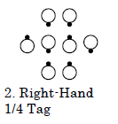
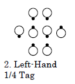
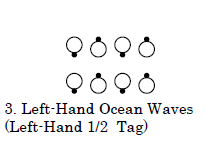
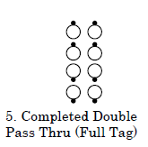
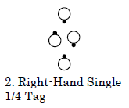

# Extend (エクステンド)

Extend（エクステンド）は、ダンサーを一つの「タッグ隊形」から次の「タッグ隊形」へと前に進める意味を含んでいる。 ８人のダンサーに向けて五つの「タッグ隊形（Tagging Formations）」がある。順に並べると
 
1. ダブル パス スルー （Zero Tag） 
1. 1/4 タッグ (1/4 Tag) 
1. オーシャン ウエイブ （1/2 Tag） 
1. 3/4 タッグ (3/4 Tag) 
1. コンプリーテッド ダブル パス スルー （４/4 Tag） 

８人のダンサーのタッグ隊形  

>
> 
> 
> 
> 
> 
> 
> 
> 
>

このコールは当初“Extend the Tag(エクステンド ザ タッグ)”と名付けられていた。1988年に、動作を変更することなく、“Ｅｘｔｅｎｄ（エクステンド）”と名前を短くした。

### 動作を始める隊形

最初の四つのタッグ隊形（例えば、ダブル パス スル-、1/4 タッグ、オーシャン ウエイブ、そして3/4 タッグ）と後ほど説明される関連する「4人のダンサーのタッグ隊形」。

### コマンド例

#### Extend

### 動作

1つのタッグ隊形から、次のタッグ隊形まで前に進む。できるならば、「注釈：」で説明されている「手の取り方」を維持する。

### 動作を終わる隊形

残りの四つのタッグ隊形（言い換えれば、1/4 タッグ、オーシャン ウエイブ、3/4 タッグ，そしてコンプリーテッド ダブル パス スルー）と後ほど説明される関連する「4人のダンサーのタッグ隊形」。

### タイミング

2拍。

### スタイリング：

すべてのダンサーはコールの結果予想される隊形（カプル手の取り方やオーシャン ウエイブの手
の取り方）に備える。

### 注釈

なかほどの三つのタッグ隊形(すなわち、1/4 タッグ隊形、オーシャンウエイブ隊形、それに3/4 タ
ッグ隊形)は、どれもオーシャン ウエイブや複数のオーシャン ウエイブの手の取り方により決定さ
れる右手や左手の隊形である。  
1/4 タッグやオーシャン ウエイブ隊形からダンサーは、前に進んで動作を始めた時と同じ隊形の
手をとって動作を終わる。ダブル パス スルー隊形からは右手の1/4 タッグ隊形になる。

動作を始める隊形で左手をとっていたら、コーラーは時として “Extend to Left-Hand Waves”のよ
うな補助語を与えるとよい。“Extend”で持ち手を変えさせるのは不適当だ。たとえば、“Heads Pass
The Ocean, Extend to Left-Hand Waves”のような｡

1/4 タッグ隊形から、“Centers Extend” あるいは “Centers Extend to the Ocean Waves”は使う
べきでない。なぜならこれらの語句はセンターズだけがアクティブであったり、センターズだけが動
くものと間違った解釈をさせる。

ダンサーの一部だけに、“Ｅｘｔｅｎｄ”をさせるコール、（Heads Pass The Ocean, Just the Boys
Extend“のような）は、ギミック（からくり）と考えられる。  
（参照： “付加細目： Commands(指示)： Gimmicks(特異な動き)”）。他のギミックとして､Heads
Ladies Chain 3/4, Line of 3 Touch 1/4, All Extend (to a Column)

向かい合ったラインやタイダル ウエイブからの“Ｅｘｔｅｎｄ”は不適当である。これらの隊形からダン
サーを一歩前に進めるには、コーラーは、“Ｓｔｅｐ tｏ a Ｗａｖｅ”や、“Ｓｔｅｐ Ｔｈｒｕ（又は右手のタ
イダル ウエイブからならば Pass Thru）”を使うべきだ。
## 4 人のダンサーのコールに“Extend”を使うには

“Extend（エクステンド）”は通常、８人のダンサーに対して使われるコールであるが、“Tag The
Line”とおなじ隊形上の関連する4 人のダンサーに対しても使われる。  
ダンサーに対する 動作： タイミング： スタイリング： および注釈：は、これらの「４人のダンサー
のタッグ隊形」にも適用される。メインストリームではこのような適用の仕方は稀にしか出会わないし、
きっとワークショップが必要だろう。

４人のダンサーのタッグ隊形  

>
> 
> 
> 
> 
> 
> 
> 
> 
>

注： 一つの1/4（あるいは3/4）タッグ隊形は、横に並んだ２つのシングル1/4(または3/4)タッグ隊形である。何故なら外側のダンサーはお互いに近づいてカプルになっている。（「付加細目： Dance Action（動作）： Square Breathing(スクエアの拡大と縮小)：」 の項を参照。）

稀な使い方ではあるが、外側のダンサーが内側のダンサーの取り合った手ではなく背中を見ているような、ある種の”ゆがんだ シングル 1/4 タッグ隊形(distorted Single 1/4 Tag Formation)“ からの“Extend” の使い方は妥当である。  
たとえば”Ends Fold, Everyone Extend“ の使い方は、オーシャンウエイブからは妥当であるが、トゥ フェイスト ラインからは不適当だ。ダンサーが普段とは異なる位置から、Extendを適用するには、他のダンサーとタンデム（二人が縦に並んだ隊形）からでなければ妥当とされない。

###### @ 版権 1994, 2000-2017 CALLERLAB、スクエアダンスコーラー国際協会。 再印刷、再発行、使用料の 発生しない写物製作はこの文章表示を条件にこれを許可する。 使用料の発生しないインターネットでの刊行 はこの文章表示を条件にこれを許可する。 使用料の発生しない一部または全ての引用はこの文章表示を条件 にこれを許可する。 いかなる写物製作または刊行においても本書内の資料は変更されまた改訂されてはなら ない。

