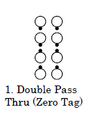
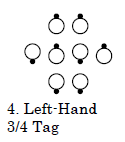
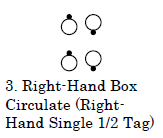
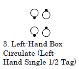

# Extend

Extend involves dancers moving forward from one tagging formation to the next. There are five eight-dancer tagging
formations, which, in order, are as follows:
 
1. Double Pass Thru (Zero Tag) 
1. 1/4 Tag 
1. Ocean Waves (1/2 Tag) 
1. 3/4 Tag 
1. Completed Double Pass Thru (Full Tag) 

> Eight-dancer Tagging Formations
> 
> 
> 
> 
> 
> 
> 
> 
> 
> 

This call was originally named "Extend the Tag".
In 1988, the name was shortened to "Extend", without changing the dance action.

### Starting formations

The first four eight-dancer tagging formations (i.e., Double Pass Thru, 1/4 Tag, Ocean Waves,
and 3/4 Tag) and the corresponding four-dancer tagging formations, which are described below

### Command example

#### Extend

### Dance action

Walk forward from one tagging formation to the next. Where possible, handedness is maintained, as
described in the comments below.

### Ending formations

The last four eight-dancer tagging formations (i.e., 1/4 Tag, Ocean Waves, 3/4 Tag, and
Completed Double Pass Thru) and the corresponding four-dancer tagging formations, which are described below.

### Timing

2

### Styling

All dancers should have their hands in ready dancing position for the formation resulting from the call
(couple handhold or Ocean Wave hand position).

### Comments
 
The three middle tagging formations (i.e., 1/4 Tag, Ocean Waves, and 3/4 Tag) are either
right- or lefthanded,
as determined by the handedness of the Ocean Wave or Ocean Waves. From a 1/4 Tag or Ocean Waves,
dancers walk forward to the ending formation that has the same handedness as the starting formation. From a
Double Pass Thru, the resulting 1/4 Tag is right-handed.

When the starting formation is left-handed, callers sometimes give helpful words, e.g., "Extend to Left-Hand
Waves". It is improper to use Extend to change handedness, e.g., "Heads Pass the Ocean, Extend to Left-Hand
Waves".

From a 1/4 Tag, "Centers Extend" or "Centers Extend To The Outsides" should not be used,
because those phrases
wrongly imply that only the centers are active or that only the centers move. Everyone is active and everyone
moves.

Asking only some of the dancers to Extend (e.g., Heads Pass The Ocean, Just The Boys Extend) is considered a
Gimmick (see "Additional Detail: Commands: Gimmicks"). Another gimmick would be Head Ladies Chain 3/4,
Lines of 3 Touch 1/4, All Extend (to a Column).

Extend is improper from Facing Lines or a Tidal Wave. From these formations, callers should use Step To A
Wave or Step Thru (or Pass Thru, if a Right-Hand Tidal Wave) to have all dancers step forward.

**Using Extend as a four-dancer call:** Although Extend is usually called to all eight dancers, it is actually a fourdancer
call related to the position of dancers as they Tag the Line. The dance action, timing, styling, and
comments also apply to these four-dancer tagging formations. Such applications are rarely encountered at
Mainstream and would probably require a workshop.

>
> Four-dancer Tagging Formations
>
> 
> 
> 
> 
> 
> 
> 
> 
>

Note: A 1/4 (or 3/4) Tag formation is the same as two side-by-side 
Single 1/4 (or 3/4) Tag formations, because
outside dancers move together to become a couple. See 
"Additional Detail: Dance Action: Square Breathing".

Extend is also proper (but quite unusual) from certain distorted 
Single 1/4 Tag formations where outside dancers
are facing the backs of the center dancers rather than facing the 
handhold of the Mini-Wave. For example, Ends
Fold and Everyone Extend is proper from an Ocean Wave but improper from a Two-Faced Line. For these
applications to be proper, dancers not in the usual position must begin in a Tandem with another dancer.

###### @ Copyright 1994, 2000-2021 by CALLERLAB Inc., The International Association of Square Dance Callers. Permission to reprint, republish, and create derivative works without royalty is hereby granted, provided this notice appears. Publication on the Internet of derivative works without royalty is hereby granted provided this notice appears. Permission to quote parts or all of this document without royalty is hereby granted, provided this notice is included. Information contained herein shall not be changed nor revised in any derivation or publication.
