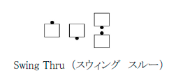
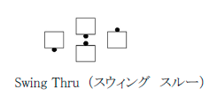

# Facing Couples Rule (向き合っているカプルの規則)

オーシャンウエイブから始めると定義された動作のうちいくつかは、向かい合ったカプルから始め
ても適切といえる。 例えば、Swing Thru （スウィング スルー）、Spin The Top （スピン ザ トッ
プ）である。  
この場合ダンサーは一歩進んで即座にオーシャンウエイブを作ってから、コールされた動作を行
う。

コーラーが左手からのコール(例： Left Swing Thru-レフト スウィング スルー)を指示した場合は、
即座に左手オーシャンウエイブを作る。

向き合っているカプルの規則が適用される場合、本動作の定義書ではこの効果があることを注釈
の中で述べる。 このような注釈がない場合は、向き合っているカプルの規則は使えない。

向き合っているカプルの規則とは呼ばれるものの、向き合っているダンサーが一歩進んだ右手の
ミニウエイブ、向かい合っているラインが一歩進んだ右手のタイダルウエイブ等も概括的に含まれ
る。

次のようなミニウエイブと向き合っているダンサーが混合した動作を始める隊形も、まれではあるが、
適切である。

> 
> 
> 
> 

向き合っているカプルの規則の適用により動作のタイミングは変わらない。

###### @ １９９４，２０００-２０１３ CALLERLAB、国際スクエアダンスコーラーズ協会 再印刷、再出版、使用料の発生しない配布物の製作はこの文章表示を条件にこれを許可する。 使用料の発生しないインターネットでの刊行はこの文章表示を条件にこれを許可する。 使用料の発生しない一部または全ての引用はこの文章表示を条件にこれを許可する。 いかなる配布物製作または刊行においても本書内の情報は変更されまた改訂されてはならない。

