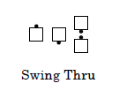
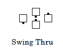

# Facing Couples Rule

A few specific calls that are defined to start from an Ocean Wave
are also proper starting from Facing Couples.
Examples include [Swing Thru](swing_thru.md) and
[Spin The Top](../ms/spin_the_top.md).
In these cases, the dancers first step into a momentary Right-Hand Ocean Wave
and complete the call.

If the caller directs a left hand call
(e.g., [Left Swing Thru](swing_thru.md)),
the dancers first step into a momentary Left-Hand Ocean Wave.

If the Facing Couples rule is applicable, the call's definition
will have a comment to that effect.
If there is no such comment, then the Facing Couples rule may not be used.

While the rule is called the Facing Couples Rule,
it is generalized to include Facing Dancers stepping to a Right-
Hand Mini-Wave and Facing Lines step to a Right-Hand Tidal Wave, etc.

The following types of mixed Mini-Wave and Facing Dancer starting formations,
while unusual, are also proper:

> 
> 
> 
> 

### Timing

Application of the Facing Couple Rule does not change the timing of the call.

###### @ Copyright 1994, 2000-2017 by CALLERLAB Inc., The International Association of Square Dance Callers. Permission to reprint, republish, and create derivative works without royalty is hereby granted, provided this notice appears. Publication on the Internet of derivative works without royalty is hereby granted provided this notice appears. Permission to quote parts or all of this document without royalty is hereby granted, provided this notice is included. Information contained herein shall not be changed nor revised in any derivation or publication.
