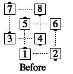
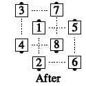
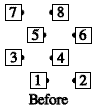
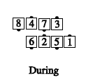
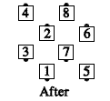

# Block Formation

A Block is a 4x4 matrix in which no 2 real bodies have a
real body between them. There is 1 space between all
bodies in a Block: in front, in back, left and right.

In Blocks you can do only 4-person calls (or sequences of
calls) that start and end in a 2x2 formation. e.g. [Partner Trade](../b2/trade.md), 
[Partner Tag](../a1/partner_tag.md), [Pass Thru](../b1/pass_thru.md),
[Touch 1/4](../b2/touch_a_quarter.md), 
[Star Thru](../b1/star_thru.md), [Square Thru](../b1/square_thru.md), 
[Wheel Thru](../a1/wheel_thru.md), etc. When doing a call in a
block, each dancer works only with the dancers in his
block; all Block calls start and end on the same 4 spots on
the floor,
for example, In Your Block, [Walk and Dodge](../ms/walk_and_dodge.md):

> 
> 
> 
> 

For some calls, for example, In Your Block, [Square Chain Thru](../a1/square_chain_thru.md),
the dancers are working in a wave during the call's action.
In that case, the Waves are slightly offset from each other,
just as the Blocks are slightly offset.
e.g., In Your Block, [Square Chain Thru](../a1/square_chain_thru.md):

> 
> 
> 
> 
> 

###### @ Copyright 1983, 1986-1988, 1995-2021 Bill Davis, John Sybalsky and CALLERLAB Inc., The International Association of Square Dance Callers. Permission to reprint, republish, and create derivative works without royalty is hereby granted, provided this notice appears. Publication on the Internet of derivative works without royalty is hereby granted provided this notice appears. Permission to quote parts or all of this document without royalty is hereby granted, provided this notice is included. Information contained herein shall not be changed nor revised in any derivation or publication.
