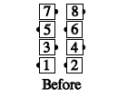
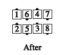
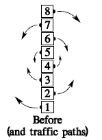
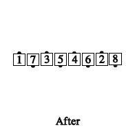
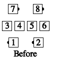
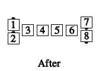

# Counter Rotate

From any formation with no dancers facing directly
toward or away from the flagpole center: Each dancer
moves forward the designated number of quarters (1/4
unless otherwise specified) around the flagpole center of
the formation, staying the same distance from that
center as though he were on a wheel turning about that
center. With each quarter he Counter Rotates, the
dancer faces a new wall (that is, he turns 90°).

> 
> 
>   
> 
> 
> 

The original outsides always finish as outsides, and the
original centers always finish as centers. For example,
"Points Counter Rotate 1/4":

> 
> 
> 
> 

*Teaching Hint:* From parallel waves, people tend to try to 
[Split Counter Rotate](../a2/box_counter_rotate.md). Describing the action, from that
formation only, as "[Concentric](concentric_concept.md) 
[Box Counter Rotate](../a2/box_counter_rotate.md)" helps a great deal.

###### @ Copyright 1983, 1986-1988, 1995-2021 Bill Davis, John Sybalsky and CALLERLAB Inc., The International Association of Square Dance Callers. Permission to reprint, republish, and create derivative works without royalty is hereby granted, provided this notice appears. Publication on the Internet of derivative works without royalty is hereby granted provided this notice appears. Permission to quote parts or all of this document without royalty is hereby granted, provided this notice is included. Information contained herein shall not be changed nor revised in any derivation or publication.
