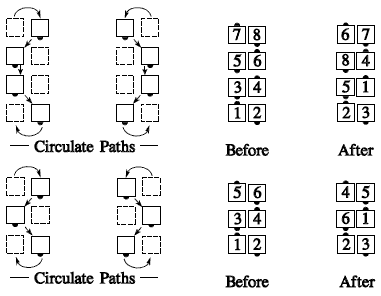
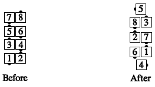

# Magic Column Formation/Concept

A Magic Column consists of the ends of one column and the
centers of the other column. The dancers act as though
they were in a column together, beginning and ending on
those four spots.

Do the call as usual, but if you move from end to center or
center to end, follow the Magic Column Circulate path.
Note that a single Magic Column is neither right- nor
left-handed. You must follow the Magic traffic pattern, and
perform any action using the hand appropriate to your
position at that point in the call.

## Magic Column Circulate

From Magic Columns: Each dancer moves forward along
one of the two circulate paths shown:

> 
> 
> 

If an end and a center are facing each other, they pass
using the end's inside shoulder (the center dancer moves
first). This takes the place of the right-shoulder rule. So
Magic Column Circulate 1½ would end like so:

> 
> 
> 

*Teaching Hint:* You can point out that the ends are
holding opposite hands from the centers--for example, the ends
have right hands joined, and the centers have left hands
joined.

If you leave the circulate path (for example, in Magic Column
Transfer, shown below), just finish the call as usual. In
this example, the ending wave is left-handed because the
centers have lefts before the final Extend:

> 
> 
> 
 
In the case of Magic Column [Walk and Dodge](../ms/walk_and_dodge.md), the rules
are the same: Those who are doing the Walk follow the
circulate path, and those doing the Dodge (and thus
leaving the circulate path) just slide sideways as usual:

> 
> 
> 

Note:
Magic column calls are only permitted where complete
magic columns exist. It would be improper, for example, to
call "Magic Walk and Dodge" from an inverted box in
isolation.

Note: At C-1 this concept is restricted to Right or Left-Hand Magic Columns only.

###### @ Copyright 1983, 1986-1988, 1995-2021 Bill Davis, John Sybalsky and CALLERLAB Inc., The International Association of Square Dance Callers. Permission to reprint, republish, and create derivative works without royalty is hereby granted, provided this notice appears. Publication on the Internet of derivative works without royalty is hereby granted provided this notice appears. Permission to quote parts or all of this document without royalty is hereby granted, provided this notice is included. Information contained herein shall not be changed nor revised in any derivation or publication.
