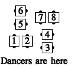
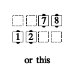
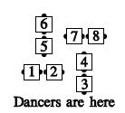
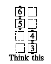
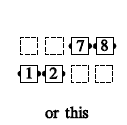
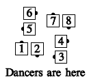
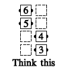
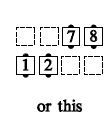
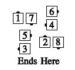

# Phantom Formation / Concept

A Phantom is a non-existent dancer with whom you may
be asked to work. A Phantom formation (for example, after
Heads [Wheel Thru](../a1/wheel_thru.md), 
[Swing Thru](../b2/swing_thru.md), Heads [Hinge](../ms/hinge.md)) has the
dancers arranged as shown below. Some of the dancers
are in Lines at the head, and some are in Lines at the
side. Each dancer acts as though he or she were in
Parallel Waves or Lines with all the Phantom positions
occupied by real dancers.

> 
> 
> 
> 
> 

It is also possible to have a phantom formation where some
of the dancers feel like they're in Columns (as below).
However, this variation is not appropriate for use at C-1.

> 
> 
> 
> 
> 

Consider Phantom Circulate:

> 
> 
> 
> 
> 
> 

Common applications include Couples Circulate, Cross Over
Circulate, Tag the Line, Turn and Deal, Wheel and Deal, Ferris Wheel,
Acey Deucey, Trade the Wave, Recycle, Ah So, Circulate, Trade Circulate.

###### @ Copyright 1983, 1986-1988, 1995-2021 Bill Davis, John Sybalsky and CALLERLAB Inc., The International Association of Square Dance Callers. Permission to reprint, republish, and create derivative works without royalty is hereby granted, provided this notice appears. Publication on the Internet of derivative works without royalty is hereby granted provided this notice appears. Permission to quote parts or all of this document without royalty is hereby granted, provided this notice is included. Information contained herein shall not be changed nor revised in any derivation or publication.
