# Step and Flip

From a General Line: The Centers step forward as the Ends Run. 
A Line with Centers facing the same direction ends in a Box (2×2); 
a Line with Centers facing opposite directions ends in a "Z" (2×3)

>
>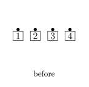
>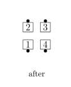
>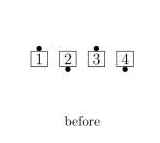
>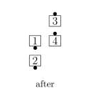
>

If the overall starting formation is a Tidal Line, 
the Centers of each side take a full step forward and
the original Ends from each side finish 
lined up with the original Ends from the other side.

>
>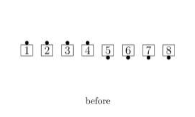
>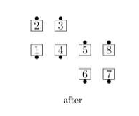
>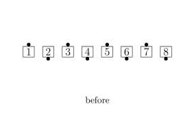
>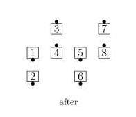
>

If the overall starting formation is a (2×4), 
each Line works independently and finishes in a Box
(2×2) or Z (2×3) on each side.

>
>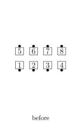
>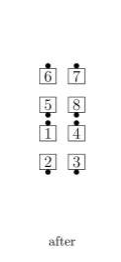
>
>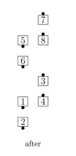
>

###### @ Copyright 1983, 1986-1988, 1995-2023 Bill Davis, John Sybalsky and CALLERLAB Inc., The International Association of Square Dance Callers. Permission to reprint, republish, and create derivative works without royalty is hereby granted, provided this notice appears. Publication on the Internet of derivative works without royalty is hereby granted provided this notice appears. Permission to quote parts or all of this document without royalty is hereby granted, provided this notice is included. Information contained herein shall not be changed nor revised in any derivation or publication.
