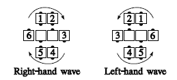
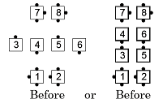
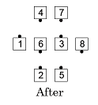
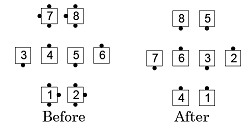
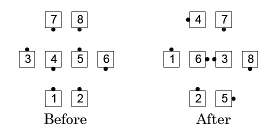
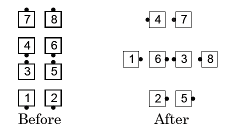

# Swing and Circle (1/4, 1/2, 3/4, Full)

From 1/4 tag, 3/4 tag, a Wave Between Parallel Mini-Waves, or Diamonds (but not
Facing Diamonds):
The dancers in the wave [Swing](../a2/slip.md). The very center
dancers [Trade](../b2/trade.md) while the outer six move
one position, in the direction shown in the
diagrams below (i.e., as determined by the ends of the wave),
turning as necessary to end in a 1/4 Tag.
This ends Swing and Circle 1/4.

> 
> 
> 

Repeat the entire above action, if necessary:

- once more, for Swing and Circle 1/2
- twice more, for Swing and Circle 3/4
- three more times, for a full Swing and circle

The Facing Couples Rule applies to the centers.

Swing and Circle 1/4:

> 
> 
>   
> 
> 

Note: Dancers who end in the outer six can roll
if their facing direction changed in the final part of the call.
For example, Swing and Circle 1/4 and Roll:

> 
> 
> 
> 

###### @ Copyright 1983, 1986-1988, 1995-2021 Bill Davis, John Sybalsky and CALLERLAB Inc., The International Association of Square Dance Callers. Permission to reprint, republish, and create derivative works without royalty is hereby granted, provided this notice appears. Publication on the Internet of derivative works without royalty is hereby granted provided this notice appears. Permission to quote parts or all of this document without royalty is hereby granted, provided this notice is included. Information contained herein shall not be changed nor revised in any derivation or publication.
