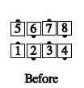
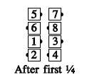
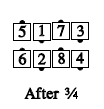
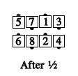
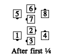
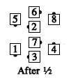

# Swing the Fractions

From Parallel Waves, or other appropriate formations:
***Those who can Turn 1/4 by the Right***,
***those who can Turn 1/2 by the Left***,
***those who can Turn 3/4 by the Right***,
***those who can Turn 1/2 by the Left***,
***and those who can Turn 1/4 by the Right***.

For example,

from Right-Hand Waves:

> 
> 
> 
> 
> 
> 
> 
> 

or from Left-Hand Waves:

> 
> 
> 
> 
> 
> 
> 
> 

For each part of the call, there must be a dancer performing this part
and the immediately preceding or following one. For example, the call
is not proper from Magic Columns.

This is a 5-part call, with each arm turn being one part.
"Swing the Fractions 4/5" is common.

###### @ Copyright 1983, 1986-1988, 1995-2021 Bill Davis, John Sybalsky and CALLERLAB Inc., The International Association of Square Dance Callers. Permission to reprint, republish, and create derivative works without royalty is hereby granted, provided this notice appears. Publication on the Internet of derivative works without royalty is hereby granted provided this notice appears. Permission to quote parts or all of this document without royalty is hereby granted, provided this notice is included. Information contained herein shall not be changed nor revised in any derivation or publication.
