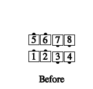
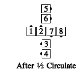
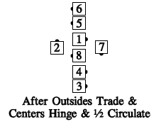
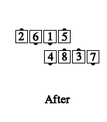

# Tally Ho

From Parallel Waves or Lines, Trade-By, and 2x4 T-Bones:
***All [1/2 Circulate](../b1/circulate.md).***
***The centers [Hinge](../ms/hinge.md) and
[1/2 Box Circulate](../b1/circulate.md),
while the outsides [Trade](../b2/trade.md).***
***Those who meet
[Cast 3/4](../ms/cast_off_three_quarters.md) while the other four dancers
[Hourglass Circulate](../a2/hourglass_circulate.md),***
 to form Parallel Waves or Lines.

>
> 
> 
> 
> 
> 
> 
> 
>

In the second example the dancers doing the Hourglass Circulate
come to the same spot and take right hands. 

###### @ Copyright 1983, 1986-1988, 1995-2021 Bill Davis, John Sybalsky and CALLERLAB Inc., The International Association of Square Dance Callers. Permission to reprint, republish, and create derivative works without royalty is hereby granted, provided this notice appears. Publication on the Internet of derivative works without royalty is hereby granted provided this notice appears. Permission to quote parts or all of this document without royalty is hereby granted, provided this notice is included. Information contained herein shall not be changed nor revised in any derivation or publication.
