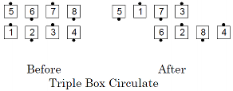
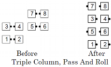
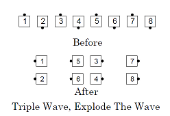

# Triple Box / Column / Line / Wave Concept

This concept establishes three groups of 4 dancers each; 
the dancers in each group are in either a Box,
Column, Line, or Wave. Since there are 12 spots and only 8 actual dancers, 
4 of the spots will be vacant (occupied by phantom dancers). 
Calls are executed by working with your group of 4. 
Examples of the spots and who works with whom:

> 
>   
>   
>   
>   
>   

Examples of Triple Box / Column / Line / Wave usage:

> 
>   
>   
>   
> 

Common Triple Box calls are Circulate, Counter Rotate, Right and
Left Thru, Scoot Back, Shakedown, Touch 1/4, Walk and Dodge, and Wheel Thru. 

Common Triple Wave or Line calls are Swing Thru, Mix, and Switch the Wave.  

Common Triple Column calls are Pass and Roll, Touch 1/4, 
and Dixie Style to a Wave.

When using this concept to execute a call, 
the "set" is the group of four dancers.
Dancers execute all calls as if only these four dancers are on the floor.
For example, in Triple Box Pass In, dancers Pass Thru
and then turn to face the center of their Triple Box.

###### @ Copyright 1983, 1986-1988, 1995-2024 Bill Davis, John Sybalsky and CALLERLAB Inc., The International Association of Square Dance Callers. Permission to reprint, republish, and create derivative works without royalty is hereby granted, provided this notice appears. Publication on the Internet of derivative works without royalty is hereby granted provided this notice appears. Permission to quote parts or all of this document without royalty is hereby granted, provided this notice is included. Information contained herein shall not be changed nor revised in any derivation or publication.
