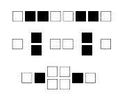
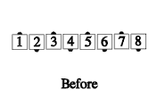

# Checkpoint \<anything> by \<anything>

From any appropriate formation: The centers of each side (shown in black
below) do Call #1, and, if it ends in a box, there is a mandatory axis change.
The remaining outside dancers slide inward, and the new centers do Call #2 and
stay in the center. 

> 
> 
> 

For example: Checkpoint [Ah So](../c1/ah_so.md) by 
[Swing Thru](../b2/swing_thru.md): 

> 
> 
> 
> 

Checkpoint [Tag the Line](../ms/tag.md) by 
[Swing Thru](../b2/swing_thru.md):

> 
> 
> 
> 

###### @ Copyright 1983, 1986-1988, 1995-2021 Bill Davis, John Sybalsky and CALLERLAB Inc., The International Association of Square Dance Callers. Permission to reprint, republish, and create derivative works without royalty is hereby granted, provided this notice appears. Publication on the Internet of derivative works without royalty is hereby granted provided this notice appears. Permission to quote parts or all of this document without royalty is hereby granted, provided this notice is included. Information contained herein shall not be changed nor revised in any derivation or publication.
