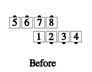
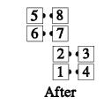

# Parallelogram Concept

From a Parallelogram (that is, offset by one or more dancer positions, most
commonly by 2): The dancers act as though they were in a 2x4 formation, but work
to the spots where real dancers are. 
For example, Parallelogram [Acey Deucey](../plus/acey_deucey.md):

> 
> 
> 
> 

Common applications include
[Circulate](../b1/circulate.md),
[Split Circulate](../b1/circulate.md),
[In Roll Circulate](../a2/in_roll_circulate.md),
[Walk and Dodge](../ms/walk_and_dodge.md),
[Scoot Back](../ms/scoot_back.md), and
[Acey Deucey](../plus/acey_deucey.md).

 If the call is one that rotates the 2x4 formation
(e.g. Counter Rotate 1/4), the formation becomes offset lines, waves, or columns
(as appropriate to the call's ending formation), offset the same way the
Parallelogram was.
The percentage of offset is preserved, not necessarily the footprints.
For example: Parallelogram [Bend the Line](../b1/bend_the_line.md):

> 
> 
> 
> 

###### @ Copyright 1983, 1986-1988, 1995-2021 Bill Davis, John Sybalsky and CALLERLAB Inc., The International Association of Square Dance Callers. Permission to reprint, republish, and create derivative works without royalty is hereby granted, provided this notice appears. Publication on the Internet of derivative works without royalty is hereby granted provided this notice appears. Permission to quote parts or all of this document without royalty is hereby granted, provided this notice is included. Information contained herein shall not be changed nor revised in any derivation or publication.
