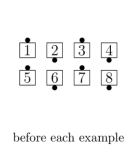
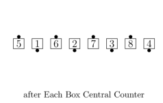

# Central <anything>

Do the Centers’ part of the <anything> call. This concept applies only to calls where
original Centers remain in the center and do not interact with the Outsides.

Typical examples include “Central Load the Boat”, “Central Spin the Windmill”, “Central
Little More”, “Central Stampede”, “Central Team Up”, and “Central Ease Off”.

> 
> 
> 
> 

“Central Cast a Shadow” and “Central Criss Cross the Shadow” are considered proper
because the original Centers remain Centers, and the Cloverleaf paths do not include
interacting with Ends.

If the starting setup is a 2x4, then Central \<anything> is done either in each Box or in each
1x4. In most cases, only one of these possibilities will work. For example, “Central Cross
Ramble” starts with a Cross Fold action and thus requires working in each wave. If Central
\<anything> can be done in either a Box or a 1x4, then it should be done in each Box unless
the caller specifies otherwise. For example, from Parallel Waves, “Central Detour” is the
same as Split Counter Rotate, but “Each Wave Central Detour” is the same as Lockit.

In cases such as “Central Counter”, where the Box default may be counterintuitive for the
dancers, the caller should specify the desired 4-person setup explicitly, using words such as
“Each Wave Central Counter” or “Each Box Central Counter”.

> 
> 
> 
> 
> 

*The following section discusses technical details
about appropriate \<anything> calls. This is
primarily intended to clarify the criteria
that a caller should use in selecting the \<anything> call.*

It is not proper to apply the Central concept to such calls as Reverse Cut/Flip the Galaxy,
Expand the Column, and Plan Ahead, because the original Centers do not remain in the
center.

It is not proper to apply the Central concept to such calls as Scoot and Little, Relay the Top,
and Transfer the Column; although the Centers of the result are the original Centers, they
get there by interacting with the Outsides. (It is proper to apply Central to Little, but not to
Scoot and Little.)

Most calls used with Central have explicitly defined Centers’ and Ends’ parts, and the
Centers can do their part in the center without considering the location or facing direction
of the Ends. There are a few calls, such as Percolate, which can be used from multiple
starting setups, some of which have the Centers remaining in the center, while others do
not. In this case, Central applies specifically to the version of the call in which Centers
remain Centers.

Example: When Percolate is danced from Facing Lines, Lines Facing Out, or Inverted
Lines, the original Centers remain Centers. Thus, Central Percolate is proper from Facing
Couples or Back-to-back Couples, and starts with Split/Box Circulate. The fact that
Percolate can also be called from Parallel Waves or from an Eight Chain Thru setup is not
relevant because the original Centers do not remain Centers from those starting setups.

> 
> 
> 
> 
> 

Example: When Sets in Motion is danced from Parallel Lines with Ends Facing Out, the
original Centers remain in the center. Thus, Central Sets in Motion is proper and ends in
Facing Couples. The fact that Sets in Motion can also be called from Waves or Lines with
Ends Facing In or in Tandem is not relevant because the Centers do not remain Centers
from those starting setups.

###### @ Copyright 2004-2021 Vic Ceder and CALLERLAB Inc., The International Association of Square Dance Callers. Permission to reprint, republish, and create derivative works without royalty is hereby granted, provided this notice appears. Publication on the Internet of derivative works without royalty is hereby granted provided this notice appears. Permission to quote parts or all of this document without royalty is hereby granted, provided this notice is included. Information contained herein shall not be changed nor revised in any derivation or publication.
