# Checker Board / Box \<anything>

From a 2x4 (or other applicable formations) with precisely two
dancers in each 1x4 oriented as Leaders in Lines. In the following
diagrams, "L" designates the Leaders in each Line as "O" designates
the other dancers. The dancers designated by "O" can be oriented in
any direction other than the same direction as the dancers designated
"L" in their own 1x4.

> 
> 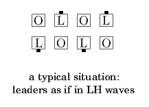
> 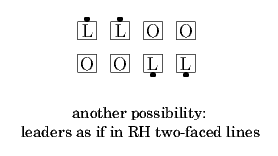
> 

## Checker Board \<anything>

The Leaders in each Line (“L” dancers) Trade with each other
as the others (“O” dancers) do the \<anything> call
working in a distorted 1x4. 
Ends in a 2x4.

> 
> 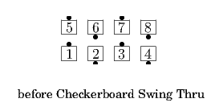
> 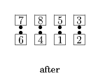  
> 
> 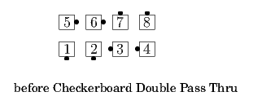
> 
> 
> 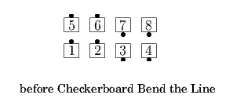
> 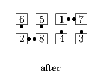
> 
> 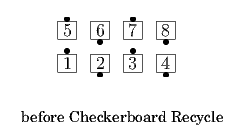
> 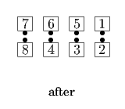  
> 

Note that although the four dancers start in a distorted 1x4, the
result of the
\<anything> call may be some other four-person formation,
such as a 2x2 or a Diamond, but they still end in the same four spots
(for example, as a distorted 2x2).

## Checker Box \<anything>

The Leaders in each Line ("L" dancers) Trade with each other
as the others ("O" dancers)
do the \<anything> call working in a distorted 2x2. Ends in a 2x4.

> 
> 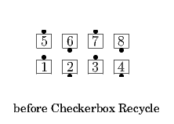
> 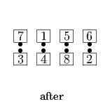  
> 
> 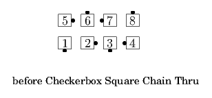
> 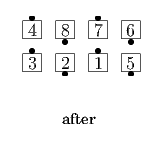  
> 

Note that although the four dancers start in a distorted 2x2,
the result of the \<anything> call may be some other four-person formation,
such as a 1x4 or a Diamond, but they still end in the same four spots
(for example, as a distorted 1x4).

### Teaching Notes
 For both Checker Board
and Checker Box, the dancers doing the Trade typically move toward
their new locations and point at the other spots as a way of helping
the other dancers keep track of the spots where they should be ending
up. While in principle the other dancers are doing their call
"working in" that set of four spots (which doesn’t change as a result
of the Trade by the Leaders), and for simple calls it is best that
they do it that way, for many calls they will find it easier to first
form a non-distorted 1x4 or Box, do the call, and then slide back
into the original spots. In these cases, especially, such "pointing"
can be very helpful. In these cases the dancers doing the trade will
also typically stand back slightly, to leave room for the others to
finish their call, before assuming their final positions.

###### @ Copyright 2004-2022 Vic Ceder and CALLERLAB Inc., The International Association of Square Dance Callers. Permission to reprint, republish, and create derivative works without royalty is hereby granted, provided this notice appears. Publication on the Internet of derivative works without royalty is hereby granted provided this notice appears. Permission to quote parts or all of this document without royalty is hereby granted, provided this notice is included. Information contained herein shall not be changed nor revised in any derivation or publication.
