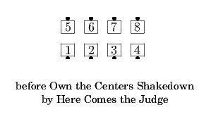
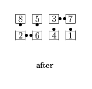
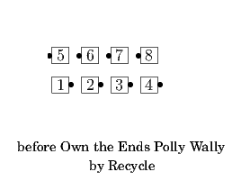
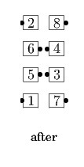

# Own the <anyone> <anything> by <anything>

Designated dancers do their part of the first
<anything> call as the others do their part of the second <anything>
call. Everyone uses their position in the overall setup to determine
their part of the call, even though other dancers may be doing a
different call. In particular, from a 2x4, for a four-person call
everybody works on their own side. The facing direction and other
characteristics of the dancers in one group do not have to be
consistent with the call that the other group is doing. Such
information about members of the other group may in certain situations
need to be used to resolve cases where there would otherwise not be
enough information to do the call (e.g., where even without applying
any special "rule" a call could be done from more than one formation),
but is otherwise ignored.

> 
> 
>   
> 
> 
> 

###### @ Copyright 2004-2021 Vic Ceder and CALLERLAB Inc., The International Association of Square Dance Callers. Permission to reprint, republish, and create derivative works without royalty is hereby granted, provided this notice appears. Publication on the Internet of derivative works without royalty is hereby granted provided this notice appears. Permission to quote parts or all of this document without royalty is hereby granted, provided this notice is included. Information contained herein shall not be changed nor revised in any derivation or publication.
