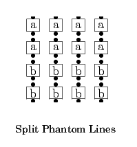
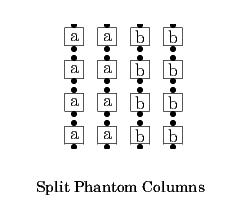
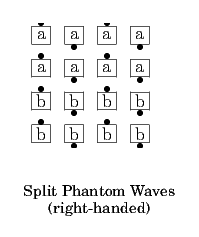
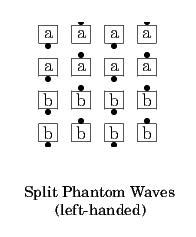
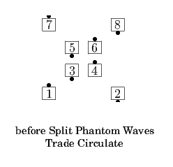
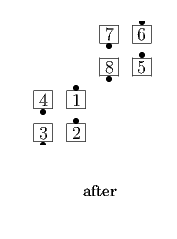
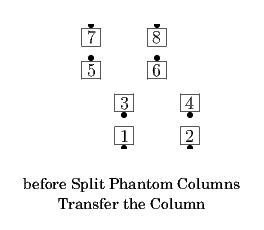
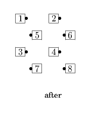

# Split Phantom Columns-Lines-Waves <anything>
**CONCEPT**   

From a 4x4 Matrix, visualized as 4 adjacent
Columns/Lines/Waves: Split the 4x4 Matrix into two pairs of adjacent
Columns/Lines/Waves and work in the resulting 2x4 Matrix on each
side.

> 
> 
> 
> 

Note that Split Phantom Lines only means that the dancers
should consider themselves to be in General Lines; it does not imply
any particular type of lines (e.g., two-faced, waves). Similarly,
Split Phantom Columns only means that the dancers should consider
themselves to be in General Columns.

Split Phantom Waves indicates the same groups of eight spots as
Split Phantom Lines, but with the additional implication that the
dancers in each line are facing in alternating directions. In that
case, the facing direction of every phantom can be assumed from the
facing direction of the real dancers.

> 
> 
>   
> 
>   
> 
> 
> 
###### @ Copyright 2004-2021 Vic Ceder and CALLERLAB Inc., The International Association of Square Dance Callers. Permission to reprint, republish, and create derivative works without royalty is hereby granted, provided this notice appears. Publication on the Internet of derivative works without royalty is hereby granted provided this notice appears. Permission to quote parts or all of this document without royalty is hereby granted, provided this notice is included. Information contained herein shall not be changed nor revised in any derivation or publication.
