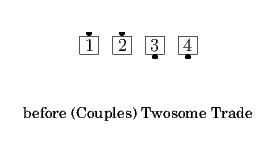
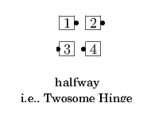
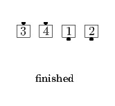
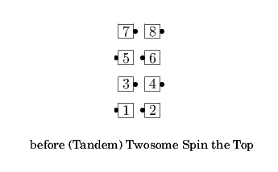
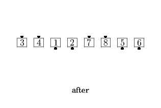
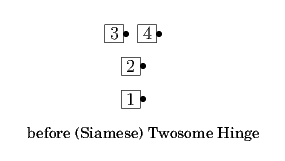
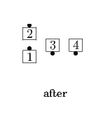

# (Couples / Tandem / Siamese) Twosome \<anything>
**CONCEPT**   

From formations with pairs of adjacent dancers facing the same
direction: Do the given call with each pair of dancers acting as a
unit, as in As Couples, Tandem, or Siamese, but with the members of
each pair moving individually and maintaining a constant displacement
from each other (staying the same distance and the same direction
from each other, for example, if one is closer to the caller and the other
further from the caller, they remain so). The pairs may start as any
mix of Couples and Tandems. If the pairing is ambiguous, the concept
must be specified as "Couples Twosome", "Tandem Twosome",
or "Siamese Twosome" as appropriate.
If the pairing is unambiguous, "Twosome"
alone is sufficient. As in As Couples, Tandem, and so on, the dancers
in each pair remain adjacent throughout the call and do not allow any
other dancers to pass between them. Note: If the call causes a pair
to turn an odd number of quarters (e.g., 1/4, 3/4), a Couple will
become a Tandem, and vice versa.

> 
> 
> 
>   
> 
>   
> 
> 
> 

### Teaching Notes
While this is not the
definition, the basic action of Twosome Hinge is just a Follow Thru
(Tandem Twosome) or a right- or left-handed 1/2 Tag (Couples
Twosome). Many calls can be danced as combinations of this action.

###### @ Copyright 2004-2022 Vic Ceder and CALLERLAB Inc., The International Association of Square Dance Callers. Permission to reprint, republish, and create derivative works without royalty is hereby granted, provided this notice appears. Publication on the Internet of derivative works without royalty is hereby granted provided this notice appears. Permission to quote parts or all of this document without royalty is hereby granted, provided this notice is included. Information contained herein shall not be changed nor revised in any derivation or publication.
