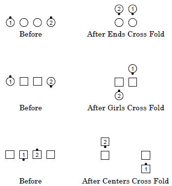

# Fold / Cross Fold

## Fall 1: Fold

### Startformation

Couple, Mini-Wave

### Kommandobeispiele

#### Boys Fold
#### Ends Fold (aus einer General Line)
#### Ladies Fold
#### Leaders Fold (aus Ocean Waves)

### Tanzaktion

Der angesprochene Tänzer geht einen Schritt nach vorne, dann in einem Halbkreis in Richtung des
neben ihm stehenden Tänzers und endet mit Blick auf diesen Tänzer. Der nicht angesprochene Tänzer ist
inaktiv und bewegt sich nicht.

### Schlussformation

Facing dancers, Tandem

### Timing

2

### Styling

keine Vorgaben

### Bemerkungen

Ein Fold kann Formationen verursachen, die für das Mainstream Programm sehr ungewöhnlich
sind. In solchen Situationen verwenden Caller im Allgemeinen implizite Anpassungen, um die Formation zu
normalisieren. Zum Beispiel „Heads Square Thru 4, Touch 1/4, Girls Fold, Double Pass Thru“:

1. Das Kommando „Girls Fold“ erzeugt eine Formation mit Tandems, die sich nicht direkt anschauen. 
1. Double Pass Thru sagt den Tänzern implizit, dass sie sich in einer Startformation für dieses Kommando befinden sollten (Facing Tandems). 
1. Das Kommando „Double Pass Thru“ wird so getanzt, als ob sich die Tandems direkt anschauen würden und endet normal.

Diese Art der impliziten Anpassung wird im Mainstream allgemein akzeptiert, insbesondere nach Fold oder Cross Fold, kann jedoch in anderen Tanzprogrammen kontrovers sein

> 
> 
> 
> 
> 

Aus einer 1x8 Formation müssen Caller vorsichtig sein, wenn sie Centers und Ends ansprechen, zum Beispiel
indem sie „Each Side, Centers Fold“, „In Each Wave Of 4, Ends Fold“ oder „Girls Fold“ sagen. Siehe
„Allgemeines: Wege, Tänzer zu benennen: Centers / Ends“.

Die Blickrichtung der nicht angesprochenen Tänzer hat keinen Einfluss auf dieses Kommando, zum Beispiel aus angemessen angeordneten Facing Lines: „Centers Star Thru, Ends Pass Thru and Fold, You're Home“.

Everyone Fold (oder Everybody Fold To Face) ist ein Gimmick (siehe „Zusätzliche Angaben: Kommandos:
Gimmicks), da diejenigen, die den Fold ausführen, nicht mit inaktiven Tänzern arbeiten. Caller, die dies verwenden, erwarten, dass sich die Tänzer am Ende anschauen (obwohl die Tanzaktion erfordert, dass Tänzer eine Position einnehmen, die direkt auf die Position des ursprünglich benachbarten Tänzers blickt und daher die Tänzer nicht direkt zugewandt sind). Aus Couples darf dieses Gimmick nicht angewendet werden.

## Case 2: Cross Fold

### Startformation

General Line

### Kommandobeispiele

#### Girls Cross Fold
#### Ends Cross Fold
#### Each Side, Ends Cross Fold (from a Tidal Wave)

### Tanzaktion

Die angesprochenen Tänzer gehen einen Schritt nach vorne und dann in einem Halbkreis bis sie der
Position des nächsten Tänzers zugewandt sind, wobei sie sowohl die Mitte der Line als auch eine
Tänzerposition passieren. Die nicht angesprochenen Tänzer sind inaktiv und bewegen sich nicht.

### Schlussformation

Siehe Bemerkungen

### Timing

4

### Styling

keine Vorgaben

### Bemerkungen

Bei Ends Cross Fold gehen die Ends, wenn sie in die gleiche Richtung schauen, rechtsschultrig
aneinander vorbei. Bei Centers Cross Fold, wenn die Centers in die gleiche Richtung schauen, tanzen sie
zunächst einen Half Sashay und gehen dann in einen Fold über, um schließlich auf die Position des
ursprünglich am weitesten entfernten Ende der Formation zu blicken.

Die Schlussformation von Cross Fold hängt davon ab, welche Tänzer Cross Fold tanzen und von deren
ursprünglichen Blickrichtungen. Zum Beispiel:

> 
> 
> 

Die Endformation kann ungewöhnlich sein und Caller normalisieren die Formation im Allgemeinen mit den
nächsten ein oder zwei Kommandos, wie im folgenden Beispiel.

> 
> 
> 
> 
> 

Caller können die Formation auch normalisieren, indem sie implizite Anpassungen verwenden (siehe die erste Bemerkung zu Fold) oder durch Verwendung von Kommandos wie „Right and Left Grand“, „Swing and
Promenade“ oder „Allemande Left“.

Aus einer 1x8 Formation muss der Caller den Tänzern verständlich machen, dass sie entweder auf jeder Seite in ihrer Line of 4 (z. B. „Each Side, Ends Cross Fold“) oder in der mittigen Line of 4 (z. B. „Center Four, Centers Cross Fold“) das Kommando ausführen müssen.

Wie bei Fold, wirken sich die Blickrichtungen der nicht angesprochenen Tänzer auf dieses Kommando nicht aus.

Ähnlich wie „Everyone Fold“ (siehe die Bemerkung oben) ist auch „Everyone Cross Fold“ ein Gimmick, das
jedoch noch seltener verwendet wird.

###### @ Copyright 1994, 2000-2019 by CALLERLAB Inc., The International Association of Square Dance Callers. Permission to reprint, republish, and create derivative works without royalty is hereby granted, provided this notice appears. Publication on the Internet of derivative works without royalty is hereby granted provided this notice appears. Permission to quote parts or all of this document without royalty is hereby granted, provided this notice is included. Information contained herein shall not be changed nor revised in any derivation or publication.
