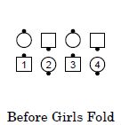
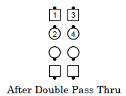
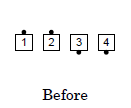
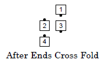

# Fold (フォールド) / Cross Fold (クロス フォールド)

## 事例１： Fold (フォールド)

### 動作を始める隊形

カプル。ミニウエイブ。

### コール例

#### Boys Fold
#### Ends Fold （一般的なラインから）
#### Ladies Fold
#### Leaders Fold (オーシャンウエイブから)

### 動作

指示されたダンサー(アクティブ)は前進し、半円弧上を、隣にいるダンサー（インアクティブ）の方向に歩き、隣のダンサーの方を向いて動作を終わる。
指示されなかったダンサーはインアクティブで動かない。

### 動作を終わる隊形

向かい合ったダンサー。 タンデム。

### タイミング

２拍。

### スタイリング

なし。

### 注釈

“Fold”は、メインストリームのもとではあまり一般的でない隊形（訳者注：Formation Pictogram に規定されていない隊形を指す。）も造ることができる。このような状況下で、コーラーは、一般的に正常な隊形に揃えるため、暗黙のアジャスメントを用いる。

例えば、Heads Square Thru 4, Touch 1/4, Girls Fold, Ｄｏｕｂｌe Pass Thru; では
 
1.  Girls Fold で直接向かい合っていないタンデムが作られる 
1.  Double Pass Thru で、暗黙のうちにダンサーがこのコールの動作を始める隊形（向かい合ったタンデム）になるよう伝えられる。 
1.  Double Pass Thru は､タンデムは向かい合っていたかのように踊られ、正常に踊り終わる。 

この種の暗黙のアジャストメントは､メインストリームでは普通に受け入れられている。特にFoldやCross Foldの後に続けて。が、しかし他のダンス プログラムでは論争を呼ぶ。

> 
> 
> 
> 
> 

1x8隊形からでは、コーラーはセンターとエンズを明確にしなければならない。例えば“Each Side, Centers Fold” とか ”In Each Wave of 4, Ends Fold” あるいは “Girls Fold”のように。“総記：Way of Naming Dancers(ダンサーの呼び方)：Centers/Ends(センターズとエンズ)”の項を参照。

指示されなかった人の顔の向きは変わらない。例えば、上手く組み立てられた向かい合ったラインから、“Centers Star Thru； Ends Pass Thru and Fold, You’re Home” も。（訳者注： Facing Zero Lineから,ということではない。Out-Order のHalf Sashayed Corner Lineから、顔の向きを正しく踊ればYou’re Home とすることも､出来るといっているだけ。）

“Everyone Fold” あるいは “Everybody Fold to Face” は特異な動き(ギミック)だ。
（「付加項目： Commands(指示)： Gimmicks(特異な動き)」を参照。）というのは、Fold をする人は､インアクティブ ダンサーと一緒に動いていない。これを使うコーラーは､明らかに向かい合ったダンサー（Facing Dancers）で終わろうとしている。（たとえ 「動作」が、始めに隣にいたダンサーの位置で向かい合うようダンサーに求めていても、向かい合っていないが。）
このギミックは､カプルからには使えない。

# 事例 2： Cross Fold (クロス フォールド)

### 動作を始める隊形

一般的なライン。

### コール例

#### Girls Cross Fold
#### Ends Cross Fold
#### Each Side, Ends Cross Fold (タイダルウエイブから)

### 動作

指示されたダンサー(アクティブ)は前進し、半円弧上を、お互いのラインのセンターと一つのダンサーポジションを通り過ぎ、次のダンサー（インアクティブ）の方を向いて動作を終わる。指示をされなかったダンサーはインアクティブで動かない。

### 動作を終わる隊形

注釈欄を参照。

### タイミング

4拍。

### スタイリング

なし。

### 注釈

“Ends Cross Fold” のとき、エンズ同士が同じ方向を向いているなら、お互い右肩ですれ違う。 “Centers Cross Fold” のとき、センターズ同士が同じ方向を向いているときは、Half Sashay をしながら オリジナルのエンズの位置に向かい合うようにFoldの動作を溶け合わせる。

“Cross Fold”の動作を終わる隊形は、どの（センターかエンズか）ダンサーが”Cross Fold” をするかと、オリジナルの顔の向きに依存する。 例えば“

> 
> 
> 

“動作を終わる隊形”は、一般的な隊形ではない。コーラーは普通、以下の例のように、次のあるいは二つ目のコールで、隊形を整える。（訳者注： Fold あるいはCross Foldの動作が終わったときに､自動的にノーマライズ(アジャスト)はせず、つぎに続く動作に任せる。）

> 
> 
> 
> 
> 
- 34 -

コーラーは、“暗黙のアジャストメント（「Ｆｏｌｄ」の最初のコメントを参照。）” や“Right and Left Grand, Swing and Promenade” あるいは “Allemande Left” などのコールを用いて、隊形を標準化する

１ｘ８隊形からは、コーラーは、ダンサーが各々サイドの４人のラインなのか（例えば、Each Side, Ends Cross Fold）, あるいは４人のセンター ライン（例えば、Center Four, Centers Cross Run）なのかを明確にしなければならない。

“Fold”では、動作の指示をされなかったダンサーの顔の向きは、このコールの影響を受けない。

“Everyone Fold”(上にあったコメントを参照)のように、”Everyone Cross Fold”はギミックであるが、あまり使われない。

###### @ 版権 1994, 2000-2019 CALLERLAB、スクエアダンスコーラー国際協会。 再印刷、再発行、使用料の 発生しない写物製作はこの文章表示を条件にこれを許可する。 使用料の発生しないインターネットでの刊行 はこの文章表示を条件にこれを許可する。 使用料の発生しない一部または全ての引用はこの文章表示を条件 にこれを許可する。 いかなる写物製作または刊行においても本書内の資料は変更されまた改訂されてはなら ない。

